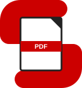
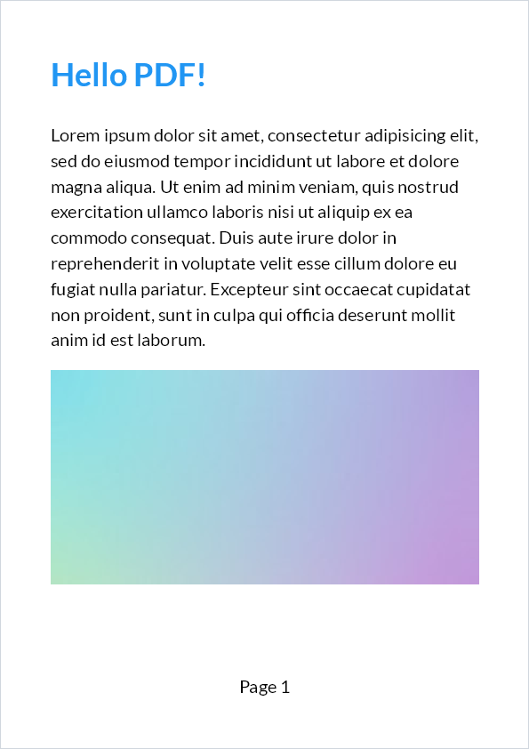

#  ShinyPDF

ShinyPDF is a modern open-source .NET library for PDF document generation. Offering comprehensive layout engine powered by concise and discoverable C# Fluent API. Shiny PDF is based on the latest fully open source version of [QuestPDF](https://github.com/QuestPDF/QuestPDF).


<table>
<tr>
    <td>👨‍💻</td>
    <td>Build production-ready PDFs in pure C# with a code-first workflow that fits naturally into your existing development process.</td>
</tr>
<tr>
    <td>🧱</td>
    <td>Compose rich layouts with predictable building blocks: text, images, borders, tables, layers, headers, footers, and more.</td>
</tr>
<tr>
    <td>⚙️</td>
    <td>Rely on a layout engine purpose-built for document generation, with robust paging, measurement, and rendering behavior.</td>
</tr>
<tr>
    <td>📖</td>
    <td>Stay productive with a concise Fluent API and full IntelliSense discoverability across the entire document DSL.</td>
</tr>
<tr>
    <td>🔗</td>
    <td>No proprietary template language. Use modern .NET features, reusable abstractions, and the tools you already trust.</td>
</tr>
</table>

<br />

## Let's get started

Begin exploring the ShinyPDF library today.

Install the [NuGet package](https://www.nuget.org/packages/ShinyPDF):

```bash
dotnet add package ShinyPDF
```

On Linux, also add the native assets for SkiaSharp and HarfBuzzSharp:

```bash
dotnet add package SkiaSharp.NativeAssets.Linux
dotnet add package HarfBuzzSharp.NativeAssets.Linux
```

Then describe your document with the Fluent API and generate the PDF:

```csharp
using ShinyPDF.Fluent;
using ShinyPDF.Helpers;
using ShinyPDF.Infrastructure;

Document.Create(container =>
{
    container.Page(page =>
    {
        page.Size(PageSizes.A4);
        page.Margin(2, Unit.Centimetre);
        page.PageColor(Colors.White);
        page.DefaultTextStyle(x => x.FontSize(20));

        page.Header()
            .Text("Hello PDF!")
            .SemiBold().FontSize(36).FontColor(Colors.Blue.Medium);

        page.Content()
            .PaddingVertical(1, Unit.Centimetre)
            .Column(x =>
            {
                x.Spacing(20);

                x.Item().Text(Placeholders.LoremIpsum());
                x.Item().Image(Placeholders.Image(200, 100));
            });

        page.Footer()
            .AlignCenter()
            .Text(x =>
            {
                x.Span("Page ");
                x.CurrentPageNumber();
            });
    });
})
.GeneratePdf("hello.pdf");
```

The result:



`Placeholders` generates sample text and images, which is handy while designing a layout. More examples are in [src/ShinyPDF.Examples](src/ShinyPDF.Examples).
