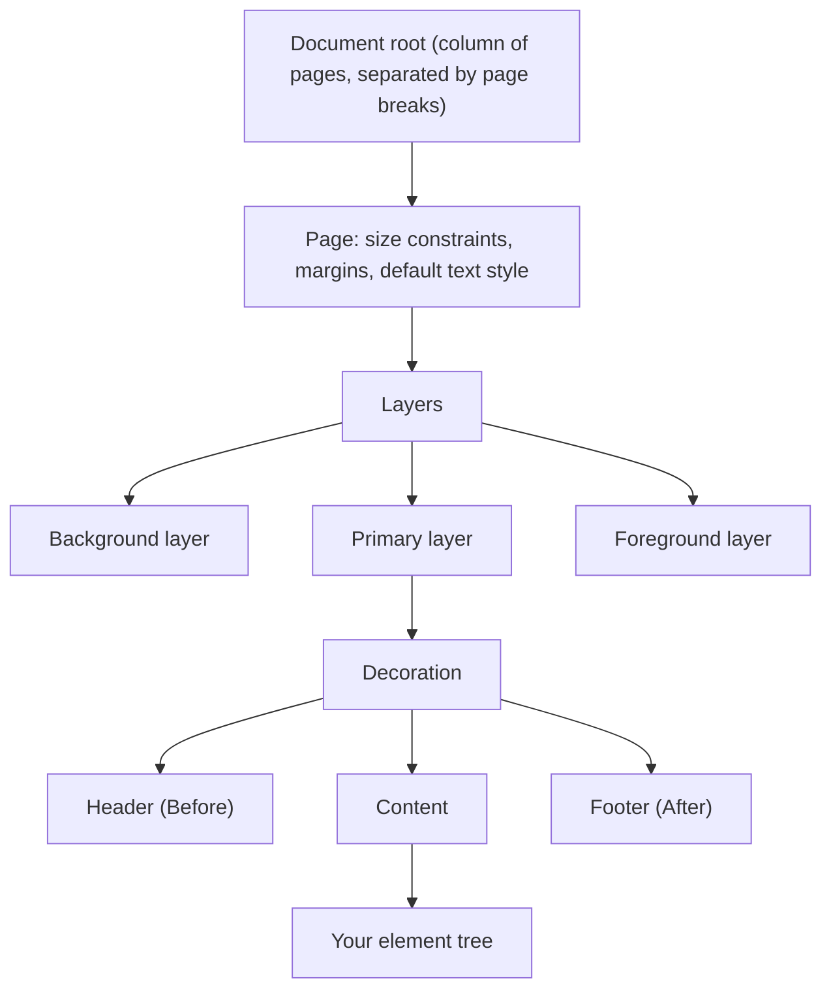
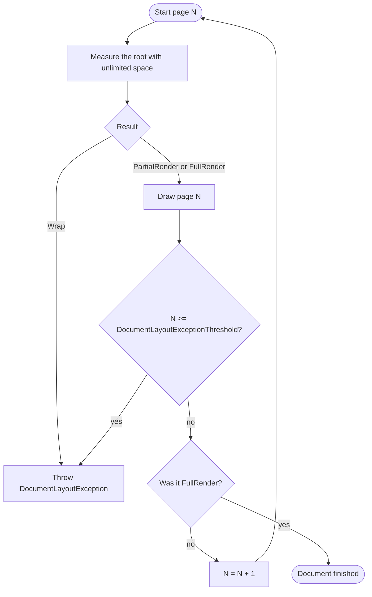
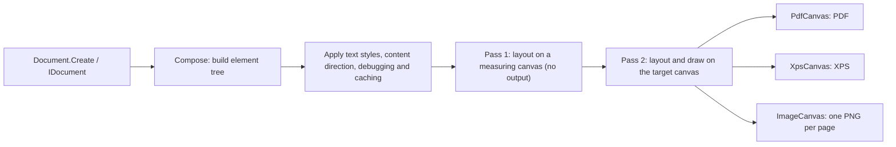

# How the layout engine works

This page explains what happens between your `Document.Create(...)` call and the finished PDF: how the Fluent API builds a tree of elements, how that tree is measured and drawn page by page, why content moves to the next page, when and why layout exceptions are thrown, and which libraries do the actual rendering. It is background reading; you do not need it to write your first document, but it makes most layout surprises predictable. For hands-on troubleshooting, see [Debug layout issues](../how-to/debug-layout-issues.md).

## The element tree

Every Fluent API call creates an element and attaches it to its parent. A chain such as

```csharp
container
    .Padding(10)
    .Background(Colors.Grey.Lighten3)
    .Width(200)
    .Text("Hello");
```

does not draw anything. It builds a small tree: a `Padding` element whose child is a `Background` element, whose child is a size constraint, whose child is a text block. Most methods (`Padding`, `Background`, `Width`, `AlignCenter`, `ShowEntire`, ...) return the `IContainer` of the new element so that the next call becomes its child. Methods that end a chain (`Text`, `Image`, `Column`, `Row`, `Table`, `Layers`, `PageBreak`, ...) produce leaves or elements with several children.

Each single-child container accepts exactly one child. Assigning a second one throws a `DocumentComposeException` at compose time; this usually means a container variable was reused outside its closure or inside a loop.

The whole document is one tree. Each `container.Page(...)` call produces a page component; internally all pages are placed in a column with page breaks between them. A page itself is composed from ordinary elements:



The tree is built exactly once, when the document is generated. `IComponent.Compose` methods and your `Action<IContainer>` lambdas run at that point, not once per page. The only user code that runs during layout is a dynamic component (see [Reusable components](../how-to/reusable-components.md#dynamic-components)), a `Canvas` handler, and dynamic images.

## Two operations: Measure and Draw

Every element implements two internal operations:

```csharp
// not compiled: simplified internal contract of every element
abstract class Element
{
    // "If I get this much space, how much do I need, and do I finish?"
    abstract SpacePlan Measure(Size availableSpace);

    // "Draw yourself into this space and remember how far you got."
    abstract void Draw(Size availableSpace);
}
```

**Measure** receives the space the parent offers and returns a `SpacePlan`: a width, a height and one of three types (`ShinyPDF.Drawing.SpacePlanType`):

| SpacePlanType | Meaning |
|---|---|
| `FullRender` | The element fits completely into the offered space, using the reported width and height. |
| `PartialRender` | The element can draw a part of itself here (using the reported size) and has more content left for the next page. |
| `Wrap` | The element cannot draw anything useful in this space. It has to move to the next page (or the layout fails). |

**Draw** paints the element into the space it was given and advances its internal progress. A column remembers which items are already finished, a text block remembers which lines it already printed, a table remembers its current row. The next page then continues from that point.

Measure has no side effects and is called often: parents measure children to plan their own layout, and most elements measure their children again inside Draw. This is also why caching matters (see below).

### Constraints go down, sizes come up

Layout is a negotiation between parent and child:

1. The parent passes an available `Size` down. A page offers the page size minus margins; `Padding(10)` offers its child 20 points less in each direction; `Width(100)` offers exactly 100 points of width; a column offers each item the full width and whatever height is still left on the page.
2. The child reports back the size it needs, never more than it was offered. If it would need more, it reports `Wrap`.
3. The parent combines the children's results into its own `SpacePlan` and reports that further up.

Some consequences that explain many layouts:

- An element can never be larger than its parent's offer. `Width(150)` inside `Width(100)` does not overflow; it reports `Wrap`, because a minimum width of 150 cannot be satisfied in 100 points.
- Most elements report only the space they need, but some take everything offered: an image (within its aspect ratio) and a `Canvas` fill the available space, and `ExtendHorizontal()` / `ExtendVertical()` stretch their child in that direction. Wrap such elements in a size constraint to give them a specific size.
- `Unconstrained` measures its child with unlimited space and reports a size of zero to its parent, so the child can draw outside the parent's bounds.
- `ScaleToFit` measures its child at smaller and smaller scales until it fits; it never splits content.

## How content flows across pages

The generator lays out the document one page at a time:



On every page the root is measured, then drawn into the measured size. As long as the root reports `PartialRender`, another page follows. Because elements remember their progress during Draw, each page continues where the previous one stopped.

### Page header, content and footer

Inside a page, the header, content and footer are arranged by a `Decoration` element (the same element that `container.Decoration(...)` creates):

- The header and the footer are measured first, with the full page area. They are drawn on **every** page and must fit **completely** on every page. If a header or footer reports `PartialRender` or `Wrap`, the page cannot be laid out.
- The content receives the remaining height (page height minus margins, header and footer) and is the only part that is split across pages.

Table headers and footers (`table.Header(...)`, `table.Footer(...)`) use the same mechanism: they repeat on every page the table spans, and each must fit entirely.

Use `ShowOnce()` and `SkipOnce()` inside a header or footer to vary them between the first and the following pages; see [Headers, footers and page numbers](../how-to/headers-footers-page-numbers.md).

### Which elements can split

| Splits across pages | How it splits |
|---|---|
| `Text` | Between lines. A single line is never split. |
| `Column` | Between items, and inside an item if that item can split. |
| `Table` | Between rows; a row splits if its cells can split. Header and footer repeat. |
| `Row` | All items continue on the next page together; the row is as tall as its tallest unfinished item. |
| `Inlined` | Between lines of items. |
| Single-child wrappers (`Padding`, `Background`, `Border`, `Width`/`Height` constraints, alignment, `Scale`, ...) | They pass the split through from their child. Padding and borders are repeated on each page part. |

| Does not split | Behavior |
|---|---|
| `Image`, `Canvas`, `Line` | Drawn as a whole into the offered space, or `Wrap` if they cannot get it. |
| `AspectRatio` (used by `Image`) | Needs its full target size; if that is taller than the remaining space, it wraps. |
| `ScaleToFit` | Shrinks the child until it fits in one piece. |
| Page header and footer, table header and footer | Must fit entirely on every page. |
| `ShowEntire()` | Turns a `PartialRender` of its child into `Wrap`: the child is moved to the next page instead of being split. |
| Content of a dynamic component | Must fit completely on the current page; the component itself decides what to show on the next page. |

A few elements control paging explicitly:

- `PageBreak()` reports `PartialRender` with zero size the first time, which ends the current page.
- `EnsureSpace(minHeight)` moves its child to the next page if the child would be split and less than `minHeight` points (default 150) are left.
- `StopPaging()` draws only what fits on the current page and then reports the element as finished, so the rest is dropped.
- `ShowOnce()` shows its child until it has been drawn completely once and hides it afterwards; `SkipOnce()` hides its child on the first page it appears on and shows it on the following ones.

### Why Wrap happens

`Wrap` is not an error by itself; it is how an element says "not here". A column that receives `Wrap` from its next item stops and reports `PartialRender` for the items it could place, so the wrapped item starts at the top of the next page. That is normal page flow.

`Wrap` becomes a problem when it reaches the root of the page. That happens when the content cannot be placed even on an empty page, for example:

- a fixed `Height(...)` or `Width(...)` (or `MinHeight`, `MinWidth`) larger than the space the parent offers,
- an image whose height at the current width is larger than the page content area,
- `ShowEntire()` around content that is longer than one page,
- a header or footer that does not fit, or leaves no room for the content that still has to be placed,
- text in a space narrower than a single character or lower than a single line.

## Why DocumentLayoutException happens

The generator throws `ShinyPDF.Drawing.Exceptions.DocumentLayoutException` in two situations, both with the same message ("Composed layout generates infinite document"):

1. **The root reports `Wrap`.** Some element needs more space than the page can ever offer, so moving it to another page would not help. Without this check the engine would produce empty pages forever.
2. **The page count reaches `Settings.DocumentLayoutExceptionThreshold`** (default: 250 pages). Either the document really is that long, or something keeps reporting `PartialRender` without ever finishing (for example a dynamic component that always returns `HasMoreContent = true`). The check runs after each drawn page, before the engine looks at whether the document is finished, so a document with exactly as many pages as the threshold already fails; the limit has to be higher than your longest document.

If your documents legitimately exceed 250 pages, raise the limit once at application startup:

```csharp
using ShinyPDF;

Settings.DocumentLayoutExceptionThreshold = 2000;
```

A dynamic component whose generated content does not fit on the current page also throws `DocumentLayoutException` (with the message "Dynamic component generated content that does not fit on a single page.").

The exception has an `ElementTrace` property. When `Settings.EnableDebugging` is on, it contains the measured element tree of the failing page, with the available and requested space of every element; otherwise it only contains a hint that the trace requires debugging mode. How to read that trace is described in [Debug layout issues](../how-to/debug-layout-issues.md#reading-a-documentlayoutexception).

## Caching

Since Measure is called many times for the same element on the same page, the engine can memoize results. With `Settings.EnableCaching` on, cacheable elements (most built-in layout elements) get a cache in front of their children: a repeated Measure with the same available size returns the stored result, and the cache is cleared when the element is drawn, because drawing changes its progress.

The default is `true` when no debugger is attached and `false` when one is. Caching only affects speed and memory, never the result, so you rarely need to touch it. Debugging works the other way around: `Settings.EnableDebugging` defaults to `true` only when a debugger is attached, because tracking every measurement costs time.

## The rendering pipeline



When you call `GeneratePdf`, `GenerateXps` or `GenerateImages` (see [Generate output](../how-to/generate-output.md)), the internal `DocumentGenerator`:

1. Calls `Compose` on the document and builds the element tree.
2. Propagates default text styles and content direction (left-to-right or right-to-left) down the tree, and adds the debugging and caching helpers if enabled.
3. Runs the complete page-by-page layout **twice** with the same page context. The first pass draws on a canvas that discards everything; its purpose is to learn where every page and every section ends. This is how `TotalPages()`, section page numbers and section links know values that are only known after the whole document has been laid out. Before each pass all elements reset their progress.
4. Runs the second pass on the target canvas: `PdfCanvas` (PDF), `XpsCanvas` (XPS) or `ImageCanvas` (one PNG per page, rendered at `DocumentMetadata.RasterDpi`).

All three canvases are thin wrappers around [SkiaSharp](https://github.com/mono/SkiaSharp), which writes the PDF and XPS files and rasterizes images. Text is shaped with [HarfBuzz](https://harfbuzz.github.io/) (through HarfBuzzSharp), which turns characters into positioned glyphs: kerning, ligatures, combining marks and right-to-left scripts. Missing glyphs are resolved through font fallback; see [Use custom fonts](../how-to/fonts.md). Both libraries ship native binaries, which is why Linux needs extra packages ([Deploy on Linux](../how-to/deploy-on-linux.md)).

Because layout runs twice, any code that runs during layout (dynamic components, `Canvas` handlers) also runs at least twice, and dynamic components are additionally called several times per page. Keep such code free of side effects.

## Relationship to QuestPDF

ShinyPDF is based on the latest fully open-source version of [QuestPDF](https://github.com/QuestPDF/QuestPDF), released under the MIT license. The layout engine described on this page, the element set and the Fluent API come from that code base; ShinyPDF uses its own `ShinyPDF.*` namespaces and is maintained independently. The repository's [LICENSE](../../LICENSE) file contains both the ShinyPDF MIT license (LM IT Services AG) and the original QuestPDF MIT license notice.

Because of this shared history, articles and answers written for that QuestPDF version often apply to ShinyPDF as well, but newer QuestPDF features and behavior are not part of ShinyPDF.
