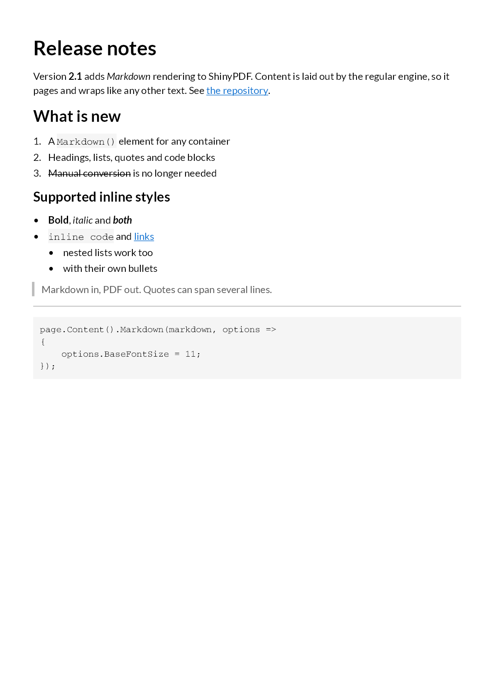
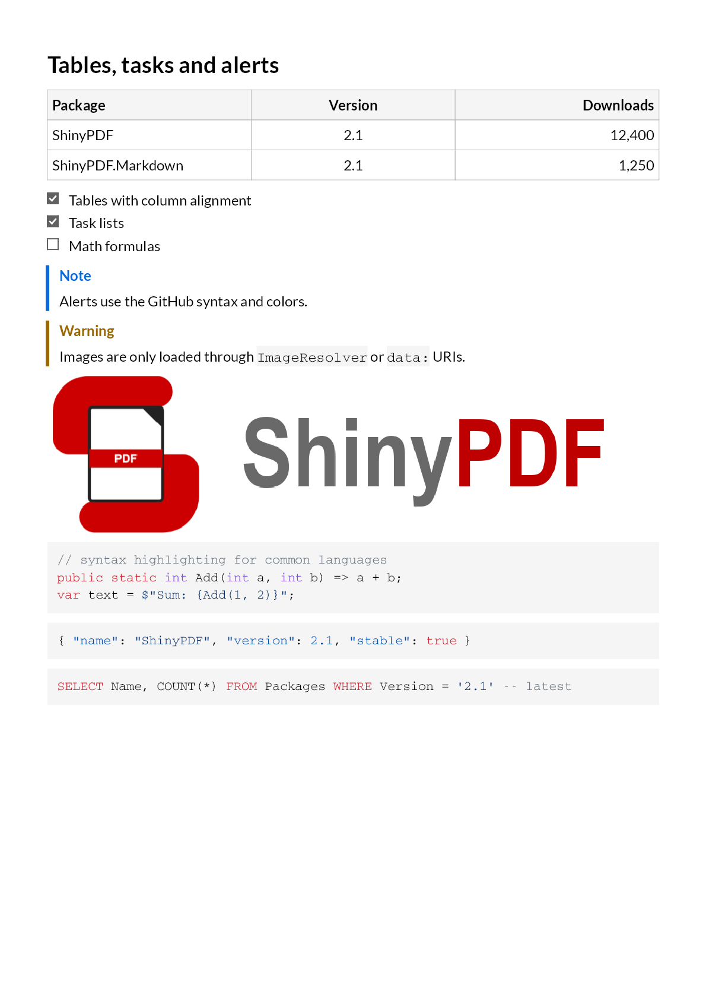

# Render Markdown

The `ShinyPDF.Markdown` package adds a `Markdown()` element that turns Markdown text into regular ShinyPDF content. Use it for content you already store as Markdown: release notes, knowledge-base articles, user input, reports built from templates.

## Install

```bash
dotnet add package ShinyPDF.Markdown
```

The extension method lives in the `ShinyPDF.Fluent` namespace, so no extra `using` is needed.

## Render Markdown into any container

```csharp
page.Content().Markdown("""
    # Release notes

    Version **2.1** adds *Markdown* support. See [the repository](https://github.com/LM-Development/ShinyPDF).

    1. A `Markdown()` element for any container
    2. Headings, lists, quotes and code blocks
    """);
```



`Markdown()` works like any other element: put it inside a `Column`, add padding, or combine it with headers and footers. Long content breaks across pages.

## Adjust the styling

Pass an options callback to change sizes, spacing and colors:

```csharp
container.Markdown(markdown, options =>
{
    options.BaseFontSize = 11;          // body text; headings scale from it
    options.BlockSpacing = 6;           // space between paragraphs, headings, lists, ...
    options.ListItemSpacing = 2;
    options.ListIndent = 18;            // width reserved for bullets and numbers
    options.LinkColor = Colors.Green.Darken2;
    options.CodeFontFamily = Fonts.Courier;
    options.CodeBackgroundColor = Colors.Grey.Lighten4;
    options.BlockquoteBorderColor = Colors.Grey.Lighten1;
    options.BlockquoteTextColor = Colors.Grey.Darken2;
    options.HorizontalRuleColor = Colors.Grey.Lighten1;
    options.TableBorderColor = Colors.Grey.Lighten1;
    options.TableHeaderBackgroundColor = Colors.Grey.Lighten4;
    options.TableCellPadding = 4;
    options.CheckboxColor = Colors.Grey.Darken2;  // task list checkboxes
});
```

Other text properties (font family, color, line height) are inherited from the surrounding `DefaultTextStyle`, so you can set them on the page:

```csharp
page.DefaultTextStyle(x => x.FontFamily(Fonts.NotoSans).LineHeight(1.4f));
```

By default headings are bold and scaled from `BaseFontSize` (level 1 is 2x, level 6 is 0.9x). To style them yourself, set `HeadingStyle`, which receives the heading level:

```csharp
options.HeadingStyle = level => TextStyle.Default
    .FontSize(level == 1 ? 24 : 16)
    .SemiBold()
    .FontColor(Colors.Blue.Darken3);
```

## Tables, task lists and alerts

GitHub-style pipe tables, task lists and alerts are rendered without extra setup:

```markdown
| Package  | Version | Downloads |
|:---------|:-------:|----------:|
| ShinyPDF | 2.1     | 12,400    |

- [x] done
- [ ] open

> [!NOTE]
> Alerts support NOTE, TIP, IMPORTANT, WARNING and CAUTION.
```



- Table header rows are bold on a background and repeat on every page the table spans. Column alignment (`:--`, `:-:`, `--:`) is applied to the cells.
- Task list items show a checkbox instead of the bullet.
- Alerts get a colored border and title. Change the title (for example to translate it) or the color per kind:

```csharp
options.AlertStyles["NOTE"] = new MarkdownAlertStyle("Hinweis", Colors.Blue.Darken2);
```

## Images

Markdown often comes from users or other systems, so the `Markdown()` element never reads files or the network on its own. Images in `data:` URIs (``) are rendered directly. For everything else, provide an `ImageResolver` that returns the image bytes, or `null` to show the alternative text:

```csharp
var imageFolder = Path.GetFullPath("content/images") + Path.DirectorySeparatorChar;

options.ImageResolver = url =>
{
    var path = Path.GetFullPath(Path.Combine(imageFolder, url));

    // only serve files inside the image folder
    return path.StartsWith(imageFolder) && File.Exists(path) ? File.ReadAllBytes(path) : null;
};
```

Images are shown at their natural size (one pixel per point) and scaled down to the available width. PNG, JPEG, WebP, GIF and BMP are supported; SVG is not. Images that cannot be decoded fall back to their alternative text.

## Syntax highlighting

Fenced code blocks with a language name are highlighted. Built-in languages and their names:

| Language | Names after the fence |
|---|---|
| C# | `csharp`, `cs`, `c#` |
| JavaScript | `javascript`, `js`, `jsx`, `mjs`, `cjs` |
| TypeScript | `typescript`, `ts`, `tsx` |
| JSON | `json`, `jsonc` |
| XML / HTML | `xml`, `html`, `xhtml`, `svg`, `xaml`, `csproj`, `razor` |
| CSS | `css`, `scss`, `less` |
| SQL | `sql`, `tsql`, `mysql`, `postgresql`, `psql` |
| Python | `python`, `py` |
| Shell | `bash`, `sh`, `shell`, `zsh`, `console` |
| PowerShell | `powershell`, `pwsh`, `ps1`, `ps` |
| YAML | `yaml`, `yml` |

Add a language with regular expressions. Rules are tried in the order they are added, so put comments and strings before keywords. A language added later replaces a built-in one with the same name:

```csharp
options.CodeLanguages.Add(new SyntaxLanguage("kotlin", "kt")
    .Rule(SyntaxTokenKind.Comment, @"//.*")
    .Rule(SyntaxTokenKind.String, "\"[^\"\\n]*\"")
    .Keywords("fun", "val", "var", "class", "if", "else", "return")
    .Types("Int", "String", "Boolean"));
```

The built-in languages are also available as templates in `SyntaxLanguages`: `SyntaxLanguages.CSharp()` returns a new instance you can extend with more rules. Change colors with `options.SyntaxColors[SyntaxTokenKind.Keyword] = "#0000FF"`. To turn highlighting off, call `options.CodeLanguages.Clear()`.

## Diagrams and formulas

Mermaid diagrams and LaTeX formulas have no built-in renderer. Register a renderer for a code block language and draw anything you like, for example an image produced by your own Mermaid or LaTeX tooling:

```csharp
options.CodeBlockRenderers["mermaid"] = (container, code) =>
    container.Image(MyDiagramService.RenderPng(code));

options.CodeBlockRenderers["math"] = (container, code) =>
    container.AlignCenter().Image(MyFormulaService.RenderPng(code));
```

The renderer replaces the code box for that language entirely.

## Supported Markdown

| Markdown | Result |
|---|---|
| `#` to `######` headings | Bold text scaled from `BaseFontSize` |
| Paragraphs, hard line breaks | Text blocks |
| `**bold**`, `*italic*`, `~~strikethrough~~` | Matching text styles, nesting combines them |
| `` `inline code` `` | Code font with background |
| Fenced and indented code blocks | Code font on a background box, whitespace kept, highlighted by language |
| `[text](url)`, `<https://...>`, `<mail@example.com>` | Clickable hyperlinks |
| `` | Image from a `data:` URI or `ImageResolver`, otherwise the alternative text |
| `-`, `*`, `+` and `1.` lists | Bullets or numbers, nested lists indented |
| `- [ ]` and `- [x]` task lists | Empty or checked checkboxes |
| Pipe tables | Bordered table, bold repeating header, column alignment |
| `>` blockquotes | Left border with muted text |
| `> [!NOTE]`, `[!TIP]`, `[!IMPORTANT]`, `[!WARNING]`, `[!CAUTION]` | Alert with colored border and title |
| `---` | Horizontal line |
| `&copy;`, `&#8364;`, ... | Decoded HTML entities |

Not supported:

- Raw HTML: shown as plain text, never interpreted.
- Math and Mermaid: no built-in rendering, use `CodeBlockRenderers` (see above). Inline `$...$` math is shown as text.
- SVG images.

Parsing follows CommonMark with GitHub extensions and is done by [Markdig](https://github.com/xoofx/markdig).
